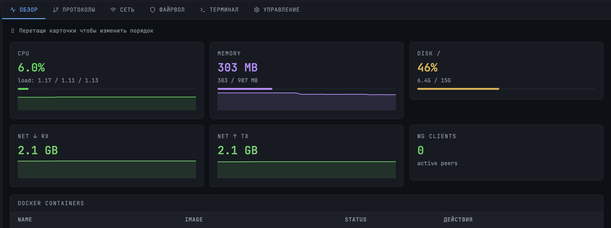

> **⚠️ All Rights Reserved.** This software is proprietary. 
> No use, modification, or distribution is permitted without 
> explicit written permission from the copyright holder.
> See [LICENSE](LICENSE) for details.


# NodeGuard

NodeGuard — это self-hosted веб-панель для управления одним или несколькими VPS серверами через прямое SSH-подключение. Никаких агентов на целевых серверах — только стандартный SSH-доступ.

Вы получаете полноценную панель управления сервером прямо в браузере: живые метрики, интерактивный терминал, управление Docker-контейнерами, установка и настройка VPN/прокси протоколов, управление файрволом, сетевыми портами и многое другое.

Ключевые особенности
- Без агентов — подключается к серверу только по SSH, ничего не нужно устанавливать на целевую машину
- Реальное время — все метрики (CPU, RAM, диск, сеть) обновляются через WebSocket каждые 5 секунд
- Мультисерверность — можно добавить неограниченное количество VPS и переключаться между ними в один клик
- Встроенный терминал — полноценный интерактивный SSH-терминал прямо в браузере (xterm.js)
- Docker под капотом — просмотр логов контейнеров, запуск, остановка, перезапуск — всё из одного интерфейса
- 15 VPN и прокси протоколов — установка и удаление в один клик (WireGuard, AmneziaWG, OpenVPN, Xray/VLESS, Shadowsocks, Trojan, MTProto, и другие)
- Управление файрволом — включение/выключение UFW, просмотр и добавление правил
- Drag-and-drop дашборд — переставляйте карточки метрик как вам удобно
- Кастомизируемые быстрые действия — редактируйте, удаляйте и добавляйте свои команды для каждого сервера
- Сетевой сканер — просмотр открытых портов и сервисов с возможностью закрыть/открыть порт в один клик



## Стек 

| Часть | Технологии |
|-------|-----------|
| Frontend | React 18 + Vite + Tailwind CSS + xterm.js + recharts + lucide-react |
| Backend | Node.js + Express + socket.io + ssh2 + bcryptjs |
| База данных | SQLite (файл `./data/dashboard.db`) |
| Деплой | Docker Compose + Nginx (опционально) |

---

## Быстрый старт

### 1. Требования на VPS

#### Поддерживаемые ОС

| ОС | Версия | Примечание |
|----|--------|-----------|
| Ubuntu | 20.04, 22.04, 24.04 | Рекомендуется |
| Debian | 11 (Bullseye), 12 (Bookworm) | |
| Astra Linux | Special Edition 1.7+ (Смоленск/Орёл) | На базе Debian 10/11 |
| CentOS / RHEL | 7, 8, 9 | Требуется ручная установка Docker |
| Rocky Linux / AlmaLinux | 8, 9 | |

**Минимальные системные требования:**
- 1 ядро CPU
- 512 МБ RAM
- 10 ГБ дискового пространства
- Доступ по SSH (порт 22)

#### ПО

- **Docker** (версия 18.09+)
- **Docker Compose** (v1.29+ или v2.0+)
- Доступ к интернету для скачивания образов

```bash
# Установка Docker
curl -fsSL https://get.docker.com | sh

# Установка docker-compose (если нет)
curl -L "https://github.com/docker/compose/releases/download/v2.24.0/docker-compose-linux-x86_64" \
  -o /usr/local/bin/docker-compose
chmod +x /usr/local/bin/docker-compose
```

### 2. Загрузите архив на VPS

```bash
scp ~/Downloads/vps-dashboard.zip root@<VPS_IP>:/root/
```

### 3. Запустите на VPS

```bash
cd /root
unzip vps-dashboard.zip
cd vps-dashboard

# Создайте секретный ключ
echo "JWT_SECRET=$(openssl rand -hex 32)" > .env

# Соберите и запустите
docker-compose up -d --build

# Проверьте статус
docker-compose ps
```

### 4. Настройка доступа (выберите один вариант)

#### Вариант A: Прямой доступ (проще, но требует открытия портов)

Отредактируйте `docker-compose.yml`, заменив `127.0.0.1:3000:80` на `3000:80` и `127.0.0.1:3001:3001` на `3001:3001`. Затем откройте порты в файрволе:

```bash
iptables -I INPUT 1 -p tcp --dport 3000 -j ACCEPT
iptables -I INPUT 1 -p tcp --dport 3001 -j ACCEPT
iptables-save > /etc/iptables/rules.v4
```

Дашборд будет доступен по адресу `http://<VPS_IP>:3000`.

#### Вариант Б: SSH-туннель (рекомендуется, безопаснее)

Порты остаются на `127.0.0.1`, доступ только через SSH.

**На вашем локальном компьютере АРМе:**

```bash
# Добавьте алиас в ~/.zshrc (или ~/.bashrc)
alias dashboard='ssh -f -N -L 8080:127.0.0.1:3000 root@<VPS_IP> && open http://localhost:8080'
source ~/.zshrc
```

Используйте: `dashboard` в терминале.

**На Windows (PowerShell):**
```powershell
ssh -L 8080:127.0.0.1:3000 root@<VPS_IP>
# Откройте браузер на http://localhost:8080
```

### 5. Начало работы

**Логин по умолчанию:** `admin` / `admin`  
⚠️ **Сразу смените пароль** в профиле (левый нижний угол сайдбара)!

---

## Настройка Nginx как Reverse Proxy (опционально)

Если вы хотите использовать Nginx для проксирования запросов (например, для HTTPS), вот минимальная конфигурация.

### 1. Установка Nginx

```bash
apt update && apt install -y nginx
```

### 2. Файл конфигурации: `/etc/nginx/sites-available/vps-dashboard`

```nginx
server {
    listen 80;
    server_name <YOUR_DOMAIN_OR_IP>;

    location / {
        proxy_pass http://127.0.0.1:3000;
        proxy_http_version 1.1;
        proxy_set_header Upgrade $http_upgrade;
        proxy_set_header Connection 'upgrade';
        proxy_set_header Host $host;
        proxy_cache_bypass $http_upgrade;
    }

    location /api/ {
        proxy_pass http://127.0.0.1:3001;
        proxy_http_version 1.1;
        proxy_set_header Upgrade $http_upgrade;
        proxy_set_header Connection 'upgrade';
        proxy_set_header Host $host;
        proxy_cache_bypass $http_upgrade;
    }
}
```

### 3. Активируйте конфиг

```bash
ln -s /etc/nginx/sites-available/vps-dashboard /etc/nginx/sites-enabled/
rm -f /etc/nginx/sites-enabled/default
nginx -t && systemctl restart nginx
```

### 4. Добавьте Basic Auth (рекомендуется)

```bash
apt install -y apache2-utils
htpasswd -c /etc/nginx/.htpasswd <USERNAME>
```

Добавьте в секцию `server` конфига Nginx:

```nginx
    auth_basic "VPS Dashboard";
    auth_basic_user_file /etc/nginx/.htpasswd;
```

### 5. Закрытие внешнего доступа к портам 3000/3001

После настройки Nginx рекомендуется закрыть прямые порты Docker:

```bash
iptables -D INPUT -p tcp --dport 3000 -j ACCEPT 2>/dev/null
iptables -D INPUT -p tcp --dport 3001 -j ACCEPT 2>/dev/null
iptables-save > /etc/iptables/rules.v4
```

Доступ к дашборду теперь только через Nginx (порт 80).

---

## Решение типичных проблем при сборке и запуске

### 1. Ошибка `SquareTerminal is not exported`

Иконка `SquareTerminal` удалена из новых версий `lucide-react`. Замените её на `Terminal` в файле `frontend/src/pages/DashboardPage.jsx`:

```bash
sed -i 's/SquareTerminal/Terminal/g' frontend/src/pages/DashboardPage.jsx
```

### 2. Ошибка `The npm ci command can only install with an existing package-lock.json`

Ваш архив не содержит `package-lock.json`. Временно замените `npm ci` на `npm install` в Dockerfile'ах:

```bash
sed -i 's/npm ci --only=production/npm install --omit=dev/' backend/Dockerfile
sed -i 's/npm ci/npm install/' frontend/Dockerfile
```

**Правильное решение:** всегда включайте `package-lock.json` в архив.

### 3. Версия `docker-compose.yml` не поддерживается

Замените `version: '3.8'` на `version: '3.3'` в `docker-compose.yml`.

### 4. Контейнеры не видят друг друга / 502 Bad Gateway

Убедитесь, что Nginx (или ваш прокси) использует правильные IP контейнеров. После пересборки IP могут измениться. Автоматизируйте обновление:

```bash
BACKEND_IP=$(docker inspect vps-dashboard-backend --format='{{range .NetworkSettings.Networks}}{{.IPAddress}}{{end}}')
FRONTEND_IP=$(docker inspect vps-dashboard-frontend --format='{{range .NetworkSettings.Networks}}{{.IPAddress}}{{end}}')
sed -i "s|proxy_pass http://[^:]*:3001;|proxy_pass http://$BACKEND_IP:3001;|" /etc/nginx/sites-available/vps-dashboard
sed -i "s|proxy_pass http://[^:]*:80;|proxy_pass http://$FRONTEND_IP:80;|" /etc/nginx/sites-available/vps-dashboard
nginx -t && systemctl restart nginx
```

**Лучшее решение:** используйте DNS-имена контейнеров (`vps-dashboard-backend`, `vps-dashboard-frontend`) вместо IP.

### 5. Недоступен порт 3000 или 3001

Проверьте, что порты открыты в iptables (если политика по умолчанию DROP):

```bash
iptables -I INPUT 1 -p tcp --dport 3000 -j ACCEPT
iptables -I INPUT 1 -p tcp --dport 3001 -j ACCEPT
iptables-save > /etc/iptables/rules.v4
```

### 6. Диск переполнен после сборок

Docker накапливает старые образы и кеш сборки. Регулярно очищайте:

```bash
docker system prune -a --force
docker builder prune --all --force
```

---

## Диагностика проблем на сервере

```bash
# Статус контейнеров
docker-compose ps

# Логи в реальном времени
docker-compose logs -f

# Проверка портов
ss -tlnp | grep -E '3000|3001|80'

# Проверка API напрямую
curl -X POST http://127.0.0.1:3001/api/auth/login \
  -H "Content-Type: application/json" \
  -d '{"username":"admin","password":"admin"}'

# Сброс пароля admin вручную (если забыли)
HASH=$(docker exec vps-dashboard-backend node -e 'const bcrypt = require("bcryptjs"); console.log(bcrypt.hashSync("admin", 10))')
sqlite3 /root/vps-dashboard/data/dashboard.db \
  "UPDATE users SET password_hash = '$HASH' WHERE username = 'admin';"
# Новый пароль будет: admin
```

---

## Структура проекта

```
vps-dashboard/
├── docker-compose.yml          # Оркестрация контейнеров
├── .env                        # JWT_SECRET (создаётся при установке)
├── data/                       # SQLite БД (создаётся автоматически)
│
├── backend/
│   ├── Dockerfile
│   ├── package.json
│   └── src/
│       ├── index.js            # Express + socket.io сервер
│       ├── db.js               # SQLite схема и инициализация
│       ├── middleware.js       # JWT авторизация
│       ├── ssh.js              # SSH подключение + парсинг метрик
│       ├── socket.js           # WebSocket: метрики, терминал, docker, ufw
│       └── routes/
│           ├── auth.js         # POST /api/auth/login, change-password, change-username
│           └── servers.js      # CRUD /api/servers + тест подключения
│
└── frontend/
    ├── Dockerfile
    ├── nginx.conf              # Reverse proxy на бэкенд
    ├── index.html
    ├── package.json
    ├── vite.config.js
    ├── tailwind.config.js
    └── src/
        ├── App.jsx             # Роутинг + Auth guard
        ├── store/index.js      # Zustand — глобальный стейт
        ├── hooks/useSocket.js  # WebSocket хук
        ├── pages/
        │   ├── LoginPage.jsx
        │   └── DashboardPage.jsx
        └── components/
            ├── Sidebar.jsx         # Список серверов + профиль
            ├── ServerModal.jsx     # Добавление/редактирование сервера
            ├── ProfileModal.jsx    # Смена логина и пароля
            ├── MetricCard.jsx      # Карточка метрики со спарклайном
            └── tabs/
                ├── OverviewTab.jsx     # Метрики + Docker контейнеры (drag-and-drop)
                ├── ProtocolsTab.jsx    # Протоколы: установка/удаление
                ├── NetworkTab.jsx      # Интерфейсы + порты с модалом
                ├── FirewallTab.jsx     # UFW правила + включение/выключение
                ├── TerminalTab.jsx     # SSH терминал (xterm.js)
                └── ManageTab.jsx       # Быстрые действия (редактируемые)
```

---

## Функциональность по вкладкам

### Обзор (Overview)
- Live-метрики: CPU, RAM, Disk, Network (+ спарклайны)
- **Drag-and-drop** для карточек (сохраняется в localStorage)
- WebSocket-обновление каждые 5 секунд
- Список Docker-контейнеров — **клик открывает модал** с логами, start/stop/restart

### Протоколы
- **15 предустановленных протоколов** (WireGuard, AmneziaWG, OpenVPN, IKEv2, Shadowsocks, Xray/VLESS, Trojan, MTProto, SOCKS5, HTTP-Proxy и др.)
- Установка и удаление в один клик
- Автоопределение уже запущенных протоколов

### Сеть
- Сетевые интерфейсы и открытые порты
- **Клик по порту** → модал с детальной информацией, кнопками "Открыть/Закрыть порт" и дополнительными действиями

### Файрвол
- Статус файрвола с **кнопкой включения/выключения**
- Таблица правил с возможностью удаления
- Добавление новых правил (порт, протокол, действие, источник)

### Терминал
- Интерактивный SSH-терминал в браузере (xterm.js)
- Полная поддержка цветов, Ctrl+C, ресайз

### Управление
- Информация о сервере (аптайм, ОС, ядро)
- **Кастомизируемые быстрые действия**: можно редактировать, удалять и добавлять свои команды
- Кнопки Reboot и Shutdown

### Профиль
- Смена логина и пароля

---

## Переменные окружения

| Переменная | По умолчанию | Описание |
|-----------|-------------|---------|
| `PORT` | `3001` | Порт бэкенда |
| `JWT_SECRET` | `changeme_very_secret_key_123` | Секрет для JWT токенов — **обязательно измените** |

Файл `.env` создается автоматически при первом запуске.

---

## Безопасность

- Порты по умолчанию слушают `127.0.0.1` (только localhost)
- Рекомендуемый доступ — через SSH-туннель или Nginx с Basic Auth
- JWT-авторизация (токен на 7 дней)
- Пароли в БД хранятся в bcrypt-хеше
- Rate limiting на API
- SSH-учетные данные не передаются клиенту

---

## Вклад в проект

Pull requests приветствуются! Пожалуйста, убедитесь, что ваш код соответствует стилю проекта.
